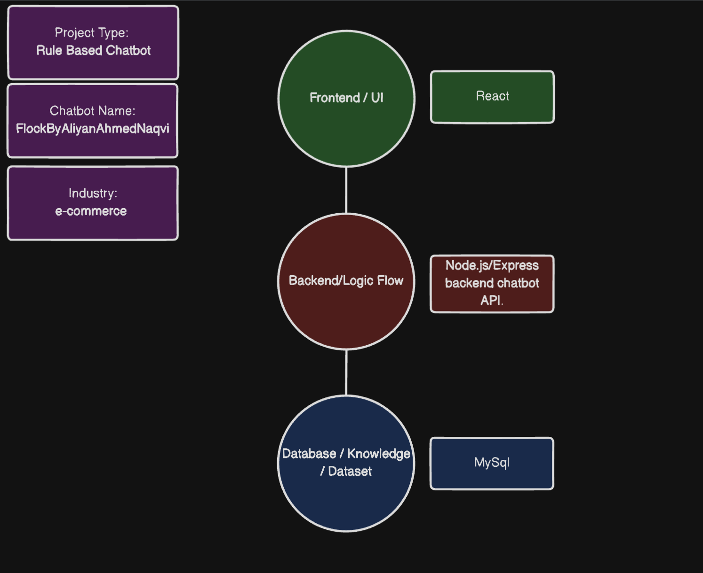

# FlockByAliyan Chatbot

A sample AI chatbot built for **customer support in an e-commerce industry**.  
This project was developed as part of the Computing Team Test B submission.

---

## 📸 Screenshot



---

## Features

- **Greetings & small talk**
- **Order status checking** (using MySQL database)
- **Product recommendations**
- **FAQ support** (refund policy, shipping time, payment methods)
- **Out-of-scope query handling**

---

## Tech Stack

- **Frontend**: React (Vite)
- **Backend**: Node.js + Express
- **Database**: MySQL

---

## ⚙️ Setup Instructions

### 1. Clone Repository

```bash
git clone https://github.com/YOUR_USERNAME/flockby-aliyan-chatbot.git
cd flockby-aliyan-chatbot
```


### 2. Database Setup

- Create the database and tables:

```sql
CREATE DATABASE chatbot_db;
USE chatbot_db;
```

- Import the provided `database.sql` file:

```bash
mysql -u root -p chatbot_db < database.sql
```

_(Change `root` and password if your MySQL uses different credentials)_

---

### 3. Backend Setup

```bash
cd backend
npm install
node server.js
```

Backend will run on:
 `http://localhost:8080`

---

### 4. Frontend Setup

```bash
cd ../frontend
npm install
npm run dev
```

Frontend will run on:
 `http://localhost:5173`

---

## 🎥 Demo

\[Screen recording link here]

---

## 👤 Author

**Aliyan Ahmed Naqvi**
FlockByAliyan Chatbot – 2025

